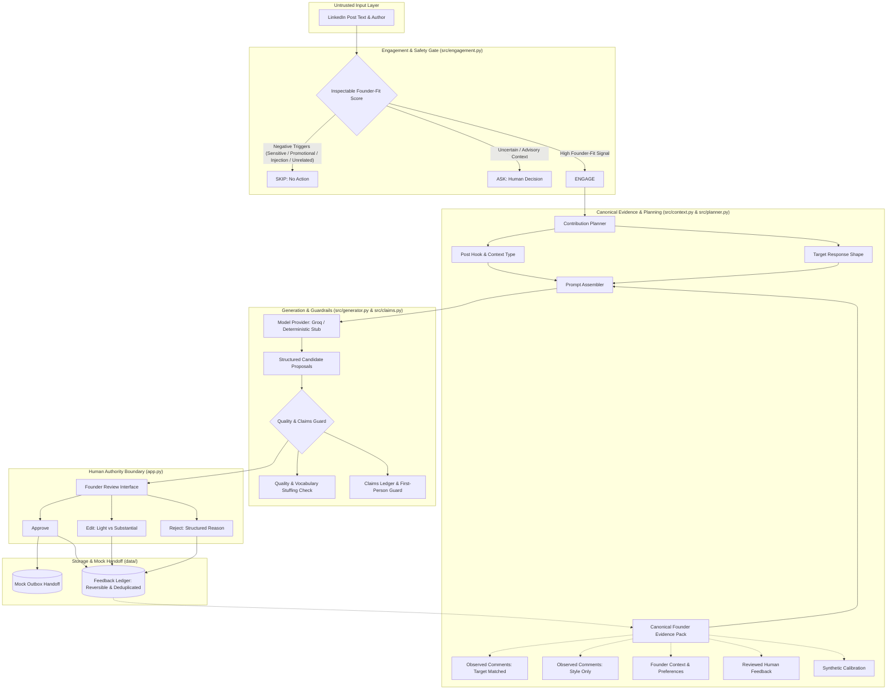

# System Architecture

## Goal

The system helps a founder decide whether a LinkedIn post is worth engaging with and proposes a useful comment while keeping the founder in control of the final response.

## Primary Flow

1. Receive a LinkedIn post as input.
2. Evaluate whether the post is relevant enough to engage with.
3. If not relevant or unsafe to comment on, return "Do not engage" with a reason.
4. If relevant, select an appropriate comment mode.
5. Retrieve relevant voice evidence and previously approved feedback.
6. Generate a small number of candidate comments.
7. Check candidates for unsupported claims, generic wording, and obvious repetition.
8. Present candidates to the founder.
9. Founder approves, edits, or rejects a candidate.
10. Store the decision as feedback for future improvement.

## Components

### 1. Input Layer

Receives the post text and basic metadata.

Input is treated as untrusted external content.

The system does not automatically access or publish to LinkedIn.

### 2. Engagement Decision

Determines whether the founder should engage.

Possible outcomes:

* `ENGAGE`
* `SKIP`

The decision should include a short explanation.

The system should prefer `SKIP` when there is no useful contribution to make or when the response would require unsupported information.

### 3. Comment Mode Selector

For an `ENGAGE` decision, select one of four modes:

* `QUICK_REACTION`
* `HUMOROUS_PERSONAL`
* `ADD_INSIGHT`
* `THOUGHTFUL_QUESTION`

These modes are derived from the collected comment examples. The examples show both very short reactions and longer comments that add a new perspective or ask a specific question.

### 4. Voice Evidence Layer

Provides examples of the founder's observed writing and commenting behaviour.

The evidence should remain separate from generated output.

The system should distinguish:

* observed evidence
* interpretation
* assumptions

Company/brand writing should not automatically be treated as the founder's personal voice. The collected research explicitly labels several examples as "Written by Byro", so these should remain separate from personal voice evidence.

### 5. Contribution Planner

Prior to generating draft words, the system constructs a grounded plan:
* Identifies the core post hook (tension, metric, or question)
* Classifies the context type (technical architecture, hackathon shipping, benchmark evaluation, etc.)
* Formulates a plausible, founder-specific contribution angle
* Determines target response shape (single concise observation or two complementary proposals)

This planning phase prevents the model from generating flattering but vacuous pleasantries.

### 6. Comment Generator

Generates a small number of candidate comments using:

* the source post
* contribution plan
* selected comment mode
* canonical voice evidence pack (target-matched comments, style-only comments, founder directives)
* previously accepted or edited examples

The generator must not invent personal experiences or unsupported facts on behalf of the founder.

### 7. Quality & Claims Guard

Before human review, candidates are strictly checked for:

* unsupported numerical metrics (`10x`, `2x`) or client outcome claims
* generic filler and empty praise
* repetition of post phrases
* excessive length and vocabulary stuffing (e.g. slang forced into irrelevant contexts)
* external person attributions without verified evidence

Any severe violation automatically blocks one-click approval, requiring founder editing or rejection.

### 8. Human Authority Boundary

The founder is the final authority.

Available actions:

* `APPROVE` (dispatches to mock outbox)
* `EDIT` (classified into light vs substantial edit magnitude)
* `REJECT` (captures structured failure category)

The system must not automatically publish the comment to LinkedIn.

### 9. Feedback Store

Store the founder's decision, edit magnitude, and final text.

Feedback is used as evidence for future generations.

The prototype does not implement opaque fine-tuning. Adaptation happens transparently through retrieval of reviewed examples, and all learned records are fully inspectable and reversible.

## Architecture Diagram



## State Model

```text
RECEIVED (Untrusted external post)
   ↓
EVALUATED (Inspectable founder-fit scoring)
   ├── SKIPPED (Non-action; clear explanation)
   ├── ASK (Human discretion; Draft Anyway option)
   └── ENGAGE (Qualified contribution opportunity)
          ↓
       PLANNED (Hook, context type, plausible contribution, response shape)
          ↓
       DRAFTED (1 or 2 distinct candidates; or CANNOT_GENERATE)
          ↓
       CHECKED (Claims guard, vocabulary stuffing, em dash, generic language)
          ↓
       REVIEWED (Human authority boundary)
       ├── APPROVED → Mock handoff outbox
       ├── EDITED   → Classified (light vs substantial) & saved to feedback
       └── REJECTED → Structured failure category & saved to feedback
```

Every transition is explicit, explainable, and inspectable.


## Data Boundaries

### Supplied Content

Examples:

* LinkedIn post text
* Public source examples
* Synthetic fixtures

This data is treated as untrusted input.

### Generated Content

Examples:

* engagement decision
* selected comment mode
* generated comment candidates
* quality warnings

Generated content must never be treated as ground truth automatically.

### Human Decisions

Examples:

* approval
* edited comment
* rejection
* optional rejection reason

These decisions are the strongest feedback signal available to the prototype.

### External Actions

The prototype performs no real LinkedIn action.

Publishing remains outside the system and under human control.

### Learning

Reviewed examples can be reused as future reference examples.

The prototype does not automatically change its own rules, retrain a model, or publish based on feedback.

## Failure Behaviour

If the system is uncertain whether a post is relevant:

`SKIP`

If no useful comment can be generated:

`SKIP`

If a candidate contains unsupported claims:

`REGENERATE or FLAG`

If the voice evidence is insufficient:

`FLAG LOW CONFIDENCE`

If the model fails:

Return an explicit error and preserve the original post/input without blocking the UI or crashing the process.

The system should fail toward non-action rather than inventing a comment.

### Retention and Reversibility

- **Auditability:** All human interactions (approvals, edits, and rejections) are immutably logged with sha256 stable IDs, timestamps, founder identity, source post context, and edit magnitude.
- **Reversible Learning:** Any feedback record can be inspected and deleted via `delete_review(record_id)`. Once deleted, the record is immediately purged from `data/feedback.json` and excluded from all future retrieval packs.
- **Deduplication:** Repeated saves of identical candidate-decision pairs are automatically de-duplicated to prevent skewing the learning retriever.
- **Zero Platform Data Retention:** No cookies, session tokens, or private LinkedIn credentials are ever requested, processed, or persisted.

### Model Provider Failure & Recovery

- **Provider Fallback:** If `GROQ_API_KEY` is not present or if the external API returns a rate-limit/connection error, the pipeline gracefully returns an explicit warning (`"Deterministic stub model used"` or `"Model could not produce a safe useful comment"`).
- **Graceful Non-Action:** When the model returns `CANNOT_GENERATE` or an empty response, the UI clearly displays the abstention reason and provides a human-guided path rather than generating hallucinatory filler.
- **Input Preservation:** Source post text, founder preferences, and review choices are preserved in `st.session_state` across model timeouts or generation retries.


## Security and Privacy

The prototype will use synthetic fixtures and permitted public research.

It will not use:

* private LinkedIn data
* cookies
* credentials
* logged-in browser sessions
* unauthorized APIs
* automated LinkedIn posting

No external side effect occurs without explicit human action.

## Cost and Operational Trade-off

The prototype intentionally uses a single straightforward generation pipeline instead of multiple autonomous agents.

This reduces:

* implementation time
* token usage
* debugging complexity
* failure surface

More sophisticated ranking, model ensembles, or long-term personalization are deferred until the core usefulness is validated.

## Riskiest Assumption

The most important assumption is that the system can produce comments that are both useful for the specific post and sufficiently aligned with the founder's real commenting behaviour.

The prototype should therefore optimize for evaluating this assumption rather than maximizing feature count.
